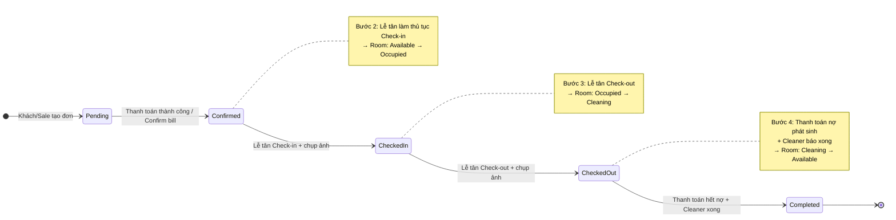
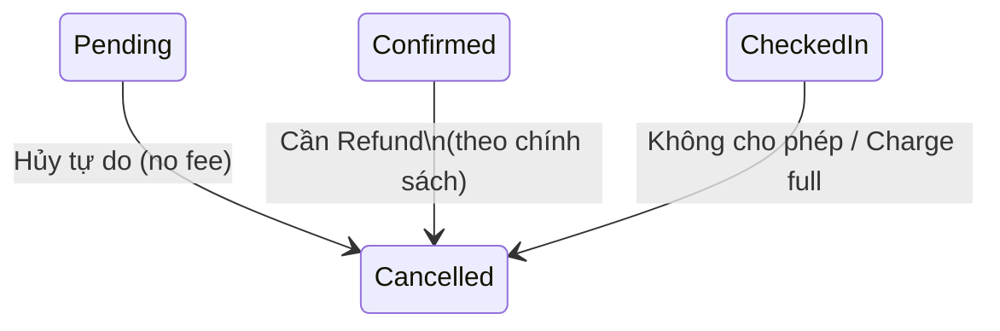
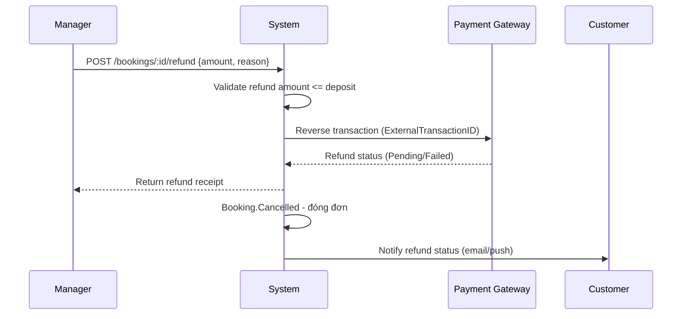
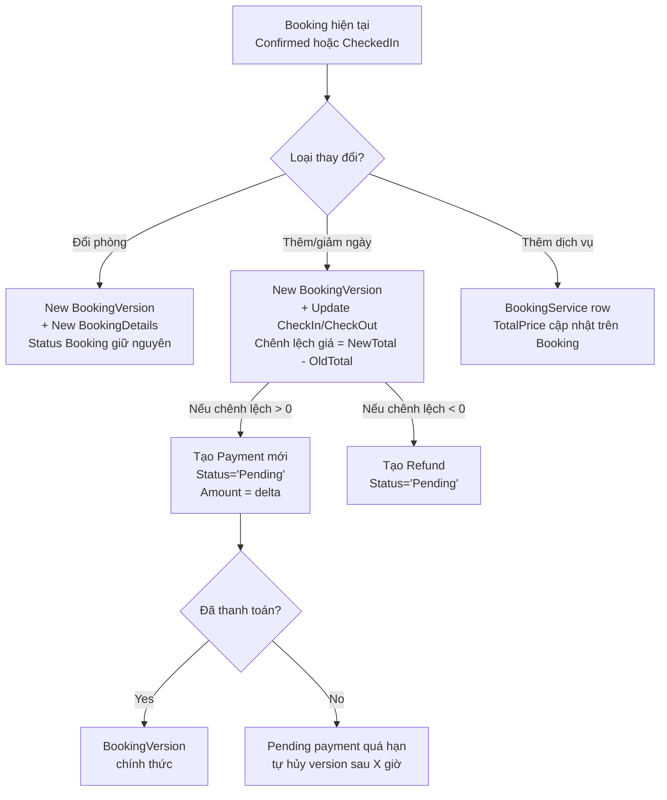

# State Machine cho Booking — Đặc tả chi tiết

Bổ sung vào thiết kế tổng thể ở `docs/business-redesign.md`. Phần này tập trung **riêng cho Booking entity**: 6 trạng thái, sơ đồ chuyển trạng thái, các nhánh rẽ và quy tắc versioning khi chỉnh sửa.

---

## 1. Sáu trạng thái chính

| # | Trạng thái | Tiếng Việt | Đặc điểm |
|---|---|---|---|
| 1 | `Pending` | Chờ xử lý | Khách tạo trên App, hoặc Sale tạo nháp, chưa thanh toán (chưa có bằng chứng chuyển khoản). |
| 2 | `Confirmed` | Đã xác nhận | Đã nhận đủ tiền hoặc đặt cọc. Phòng được giữ chỗ (Hold). Có thể bỏ qua cọc nếu khách quen. |
| 3 | `CheckedIn` | Đã nhận phòng | Khách đã đến, Lễ tân đã chụp ảnh Checklist nhận phòng. |
| 4 | `CheckedOut` | Đã trả phòng | Khách đã rời đi, Lễ tân đã chụp ảnh Checklist trả phòng. Phòng chờ dọn dẹp + quyết toán. |
| 5 | `Completed` | Hoàn tất | Tiền đã quyết toán xong (không nợ), phòng đã dọn xong (Cleaner đã log). |
| 6 | `Cancelled` | Đã hủy | Khách hoặc hệ thống hủy đơn. |

---

## 2. Sơ đồ chuyển trạng thái (Transitions)

### 2.1 Luồng lý tưởng (Happy Path)



### 2.2 Bảng các transition

| # | Từ | Sang | Điều kiện | Tác nhân |
|---|---|---|---|---|
| T1 | (khởi tạo) | `Pending` | Tạo booking mới từ App hoặc Sale | Customer, Receptionist (walk-in), Sale |
| T2 | `Pending` | `Confirmed` | Thanh toán thành công (1 payment `Status='Paid'`) HOẶC Sale/Lễ tân confirm (khách quen không cần cọc) | System (webhook) hoặc Receptionist |
| T3 | `Confirmed` | `CheckedIn` | Lễ tân làm thủ tục check-in + chụp ảnh checklist nhận phòng | Receptionist |
| T4 | `CheckedIn` | `CheckedOut` | Lễ tân làm thủ tục check-out + chụp ảnh checklist trả phòng | Receptionist |
| T5 | `CheckedOut` | `Completed` | (a) Tất cả `Payment` còn nợ đã `Paid` VÀ (b) Phòng đã được Cleaner log `ChecklistLog` cho lượt dọn này | System (auto) hoặc Manager (override) |
| T6 | `Pending` | `Cancelled` | Khách hoặc Lễ tân hủy. Không tính phí. | Customer, Receptionist |
| T7 | `Confirmed` | `Cancelled` | Cần qua bước Refund theo chính sách khách sạn (xem §3.2) | Manager |

---

## 3. Các nhánh rẽ (Exceptions & Rules)

### 3.1 Hủy đơn



| Trạng thái nguồn | Cho phép hủy? | Phí / Hoàn tiền |
|---|---|---|
| `Pending` | ✅ Bất cứ lúc nào | Không tính phí, không cần refund. |
| `Confirmed` | ✅ Có thể | Cần chạy quy trình **Refund** (xem §3.2). |
| `CheckedIn` | ❌ Không cho phép hủy thường. Nếu khách rời sớm → check-out sớm (giữ nguyên state machine, chỉ short-circuit T4). | Charge đủ số đêm đã ở (early-departure). |
| `CheckedOut` / `Completed` | ✅ Có thể nhưng không thay đổi state Booking — chỉ tạo `Refund` ngược. | Theo chính sách. |
| `Cancelled` | ❌ Terminal state. | — |

### 3.2 Quy trình Refund (khi hủy `Confirmed`)



Lưu ý: Một `Refund` được mô hình hóa như một `Payment` (Method=`'Refund'`, Amount= âm hoặc ghi chú `IsRefund=1`) — không cần bảng riêng.

### 3.3 Chỉnh sửa (Versioning) — đổi phòng, thêm ngày

> **Quy tắc chung:** Khi Booking đang ở `Confirmed` hoặc `CheckedIn` và có yêu cầu **Change Booking** (đổi phòng / thêm ngày / đổi số khách), trạng thái Booking **giữ nguyên**, nhưng tạo **BookingVersion mới** và có thể tạo thêm **Payment chênh lệch** với `Status='Pending'`.



**Quy tắc versioning:**
1. **BookingVersion chỉ append-only** — không bao giờ UPDATE version đã tạo. Sửa = tạo version mới (đồng thời đánh dấu `ChangeReason`).
2. **Booking.CurrentVersion** luôn trỏ đến version mới nhất (`MAX(VersionNumber)`).
3. **BookingDetails** luôn thuộc version, không bao giờ thuộc booking trực tiếp — query dữ liệu thông qua `Booking → BookingVersion.CurrentVersion → BookingDetails`.
4. **Payment cho chênh lệch giá:**
   - Nếu `NewTotal > OldTotal` → tạo `Payment` mới, `Status='Pending'`, yêu cầu khách thanh toán trước khi version được "kích hoạt".
   - Nếu `NewTotal < OldTotal` → tạo `Payment` `Method='Refund'`, `Status='Pending'`.
   - Nếu `NewTotal == OldTotal` (đổi phòng nhưng giá ngang) → không tạo payment, version tự động "kích hoạt".

---

## 4. Tác động lên Room Status

Mỗi transition của Booking là một "ngòi" cho Room Status:

| Booking chuyển | Room chuyển | Ghi chú |
|---|---|---|
| `Pending` → `Confirmed` | `Available` (giữ) | Phòng vẫn khả dụng cho các đơn khác đến khi Check-in thật. |
| `Confirmed` → `CheckedIn` (T3) | `Available` → `Occupied` | Giữ phòng thật sự. |
| `CheckedIn` → `CheckedOut` (T4) | `Occupied` → `Cleaning` | Chuyển cho Cleaner xử lý. |
| `CheckedOut` → `Completed` (T5) | `Cleaning` → `Available` | Khi Cleaner log ChecklistLog xong. |
| `*` → `Cancelled` | (giữ nguyên Room) | Không động chạm Room (phòng đã được giữ riêng khi CheckedIn, hoặc không ai hủy phòng chưa ai ở). |

---

## 5. Mapping vào schema & entities

### 5.1 Bảng `Bookings` — enum `Status`

```sql
ALTER TABLE Bookings ALTER COLUMN Status nvarchar(20) NOT NULL;
```

Enum hiện hành (in code, không phải SQL CHECK constraint):
- `Pending`
- `Confirmed`  ← duy nhất có version được "kích hoạt" kèm Payment chênh lệch = Paid
- `CheckedIn`
- `CheckedOut`
- `Completed`
- `Cancelled`

### 5.2 Bảng `Bookings` — cột cần thêm

| Cột | Kiểu | Mô tả |
|---|---|---|
| `ActualCheckIn` | `datetime`, nullable | Thời điểm thực tế khách nhận phòng (do Lễ tân nhập). |
| `ActualCheckOut` | `datetime`, nullable | Thời điểm thực tế khách trả phòng. |
| `CheckedInBy` | `uniqueidentifier`, FK → `StaffInfo` | Lễ tân đã làm check-in. |
| `CheckedOutBy` | `uniqueidentifier`, FK → `StaffInfo` | Lễ tân đã làm check-out. |
| `CheckInEvidenceImage` | `nvarchar(MAX)`, nullable | Ảnh checklist nhận phòng. |
| `CheckOutEvidenceImage` | `nvarchar(MAX)`, nullable | Ảnh checklist trả phòng. |

> **Lưu ý:** Các cột `CheckIn` / `CheckOut` hiện tại trên `BookingVersion` thuộc về **dự kiến**, không phải thực tế. Cột mới thuộc về Booking (thực tế) phân biệt rõ version.

### 5.3 Bảng `Payments` — enum `Method` mở rộng

Thêm `'Refund'` vào `enum` để mô hình hóa hoàn tiền như chiều ngược của `Payment`.

---

## 6. API endpoints cần bổ sung (theo state machine)

| Method & Path | Từ → Sang | Tác nhân |
|---|---|---|
| `POST /bookings/:id/confirm` | T2 | System (auto via webhook) hoặc Receptionist |
| `POST /bookings/:id/check-in` | T3 | Receptionist |
| `POST /bookings/:id/check-out` | T4 | Receptionist |
| `POST /bookings/:id/complete` | T5 | System (auto) khi đủ điều kiện |
| `POST /bookings/:id/cancel` | T6, T7 | Customer (T6 only) hoặc Receptionist (T6) / Manager (T7) |
| `POST /bookings/:id/refund` | (Refund flow) | Manager |
| `POST /bookings/:id/versions` | Versioning | Customer hoặc Receptionist |
| `POST /bookings/:id/versions/:versionId/activate` | Kích hoạt version sau khi Payment chênh lệch = Paid | System (auto) |

---

## 7. Test checklist cho state machine

| Test case | Mong đợi |
|---|---|
| `Pending` → `Confirmed` qua payment thành công | OK, giữ Room = Available. |
| `Pending` → `Confirmed` không có payment (khách quen) | OK, ghi `ConfirmedBy=StaffId`. |
| `Confirmed` → `CheckedIn` thiếu ảnh evidence | Từ chối với 400. |
| `CheckedIn` → `CheckedOut` rồi Cancel | Từ chối — phải check-out bình thường. |
| `CheckedOut` → `Completed` khi vẫn còn dịch vụ pending | Từ chối cho đến khi tất cả `Payment.Status = Paid`. |
| `Cancelled` → bất cứ state nào khác | Từ chối 409. |
| Đổi phòng khi `CheckedIn` | Tạo `BookingVersion` mới, không tạo Payment (giá = giá). |
| Thêm 1 đêm khi `Confirmed` | Tạo `BookingVersion`, tạo `Payment Pending` chênh lệch = 1× nightly rate. |

---
