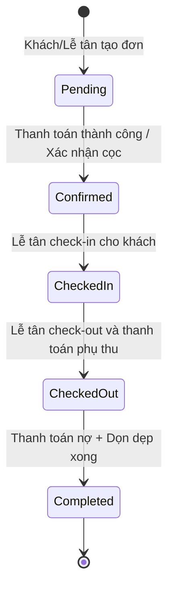
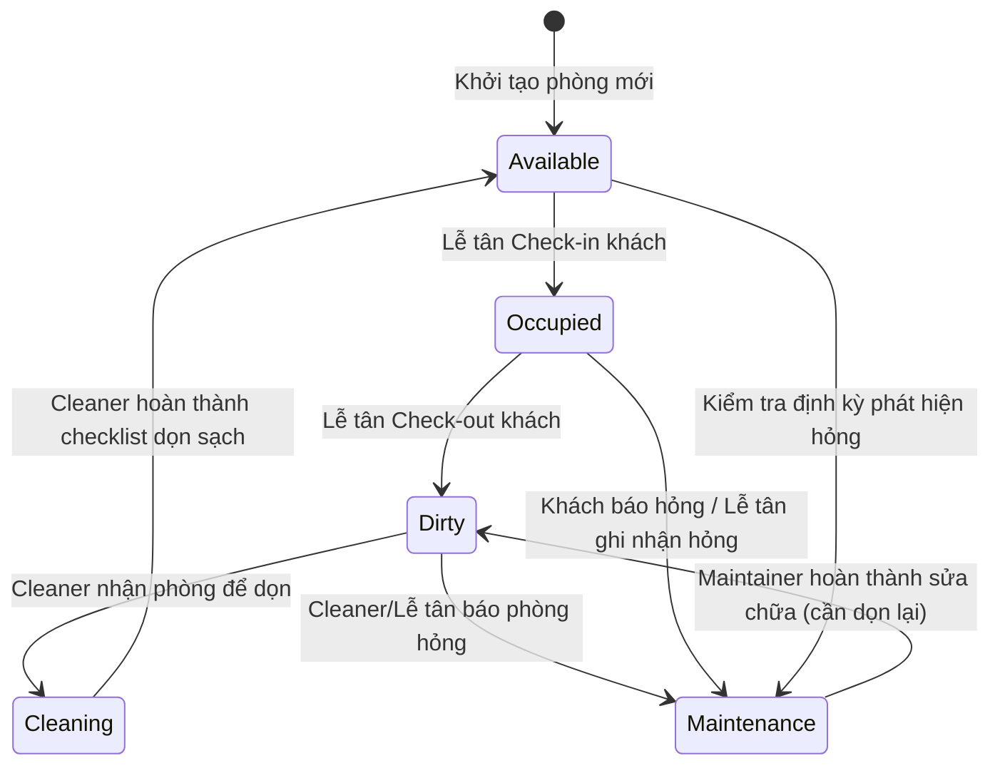

# Thiết kế lại Nghiệp vụ Hệ thống Quản lý Khách sạn (HotelHub)

Tài liệu này đề xuất thiết kế lại luồng nghiệp vụ của hệ thống **HotelHubManagement** nhằm tối ưu hóa sự phối hợp giữa 5 vai trò cốt lõi: **Khách hàng (Customer)**, **Lễ tân (Receptionist)**, **Nhân viên vệ sinh (Cleaner)**, **Nhân viên bảo trì (Maintainer)**, và **Quản lý (Manager)**.

---

## 1. Bản đồ trạng thái & Vòng đời của Phòng và Đặt phòng

Để hệ thống hoạt động gắn kết, trạng thái của **Phòng (Room)** và **Đặt phòng (Booking)** phải liên kết chặt chẽ với nhau thông qua các hành động của các tác nhân.

### 1.1 Vòng đời trạng thái Đặt phòng (Booking Status)
Hệ thống sẽ cập nhật trạng thái đặt phòng để theo dõi chính xác hành trình của khách (chi tiết tại `booking-state-machine.md`):

---

### 1.2 Vòng đời trạng thái Phòng (Room Status)
Trạng thái phòng điều phối trực tiếp công việc của bộ phận Vệ sinh và Bảo trì:

---

## 2. Kịch bản sử dụng chi tiết theo vai trò (Use Cases & Flows)

### 2.1 Khách hàng (Customer) - Trải nghiệm Đặt phòng & Tiện ích
Khách hàng tương tác chủ yếu qua ứng dụng di động hoặc cổng thông tin tự phục vụ:
1.  **Tra cứu & Tìm phòng:** Xem danh sách phòng trống (`Available`) theo ngày Check-in/Check-out.
2.  **Đặt phòng:** Chọn phòng, nhập số lượng khách, ghi chú yêu cầu đặc biệt. Trạng thái đặt phòng chuyển sang `Pending`.
3.  **Thanh toán:** Thực hiện thanh toán online (Momo, VNPay, Visa). Đơn chuyển sang `Confirmed`.
4.  **Đặt dịch vụ tại phòng:** Trong thời gian lưu trú (Booking ở trạng thái `CheckedIn`), Khách có thể gọi thêm dịch vụ (đồ ăn, thức uống, giặt là...) thông qua ứng dụng. Dịch vụ tự động cộng dồn vào hóa đơn đặt phòng.
5.  **Gửi yêu cầu hỗ trợ/Báo hỏng:** Khách có thể gửi tin nhắn báo hỏng thiết bị trực tiếp từ ứng dụng.

### 2.2 Lễ tân (Receptionist) - Trung tâm điều phối vận hành
Lễ tân là cầu nối giữa Khách hàng và bộ phận Vận hành nội bộ:
1.  **Check-in & Đặt phòng trực tiếp tại quầy (Walk-in Booking):**
    *   *Nghiệp vụ cốt lõi:* Hỗ trợ khách vãng lai đặt phòng trực tiếp tại quầy mà không cần tài khoản online trước.
    *   *Cơ chế tự động:* Nhập thông tin Khách hàng (`customerFullName`, `customerPhone` bắt buộc, `customerEmail` tùy chọn). Hệ thống sẽ tự động tạo một tài khoản stub (`walkin_<phone>`) liên kết với Khách hàng mới để đảm bảo tính toàn vẹn của dữ liệu trong database.
    *   Tạo đơn đặt phòng trực tiếp, thực hiện check-in ngay lập tức nếu đến ngày nhận phòng.
2.  **Tiếp đón & Check-in trực tuyến:**
    *   Xác minh thông tin đặt phòng (`Confirmed`) trên hệ thống.
    *   Bàn giao chìa khóa phòng, xác nhận trên hệ thống để chuyển Booking sang `CheckedIn` và phòng sang `Occupied`.
3.  **Quản lý dịch vụ:** Ghi nhận các yêu cầu dịch vụ thủ công nếu khách gọi điện lên quầy.
4.  **Tiếp nhận báo hỏng:** Tiếp nhận phản hồi hỏng hóc từ khách, tạo `IssueReport` nhanh để chuyển phòng sang `Maintenance`.
5.  **Thanh toán phụ thu & Check-out:**
    *   Khi khách trả phòng, hệ thống tự động tổng hợp: Tiền phòng còn thiếu + Tiền các dịch vụ phát sinh.
    *   Lễ tân thu tiền phụ thu (tiền mặt/quẹt thẻ), in hóa đơn, chuyển Booking sang `CheckedOut`.
    *   Hệ thống **tự động** cập nhật trạng thái phòng vừa trả sang `Dirty`.

### 2.3 Nhân viên vệ sinh (Cleaner) - Đảm bảo chất lượng buồng phòng
Cleaner sử dụng thiết bị di động để nhận và thực hiện nhiệm vụ dọn dẹp:
1.  **Nhận phòng dọn:** Xem danh sách phòng ở trạng thái `Dirty`. Chọn phòng để dọn dẹp (phòng chuyển sang `Cleaning` để tránh trùng lặp cleaner khác vào).
2.  **Thực hiện dọn dẹp theo checklist:**
    *   Hệ thống hiển thị danh sách checklist dọn phòng mẫu (đã được nạp sẵn tĩnh trong DB qua seed).
    *   Cleaner dọn dẹp và tích chọn hoàn thành từng hạng mục.
3.  **Báo cáo hoàn tất:**
    *   Chụp ảnh phòng sạch làm bằng chứng nghiệm thu (`EvidenceImage`).
    *   Xác nhận hoàn thành dọn phòng → Trạng thái phòng chuyển về `Available`.
4.  **Báo hỏng phòng:** Nếu trong quá trình dọn dẹp, cleaner phát hiện hỏng hóc → Tạo nhanh `IssueReport` → Phòng tự động chuyển sang `Maintenance`.

### 2.4 Nhân viên bảo trì (Maintainer) - Khắc phục sự cố kỹ thuật
Maintainer nhận nhiệm vụ sửa chữa thiết bị để đưa phòng trở lại kinh doanh sớm nhất:
1.  **Tiếp nhận sự cố:** Xem danh sách phòng đang ở trạng thái `Maintenance` kèm mô tả sự cố từ Lễ tân hoặc Cleaner báo lên.
2.  **Thực hiện sửa chữa:** Bấm nhận sửa chữa sự cố.
3.  **Nghiệm thu hoàn tất:**
    *   Sau khi sửa xong, Maintainer tải lên hình ảnh/video nghiệm thu kết quả (`MaintenanceProve`).
    *   Chuyển trạng thái `IssueReport` sang `Resolved`.
    *   Hệ thống **tự động** chuyển trạng thái phòng từ `Maintenance` về `Dirty` (bắt buộc Cleaner phải vào lau dọn bụi bẩn sau sửa chữa trước khi cho khách thuê).

### 2.5 Quản lý (Manager) - Giám sát và Quản trị danh mục tối giản
Theo thiết kế nghiệp vụ tối giản mới, vai trò Manager tập trung **duy nhất** vào việc quản trị danh mục tài nguyên và giá cả buồng phòng (không tham gia vào thiết lập quy trình checklist):
1.  **Quản lý danh mục Phòng & Loại phòng:** 
    *   Thêm mới, chỉnh sửa thông tin phòng (`RoomCode`, `Floor`, `Status`).
    *   Cập nhật thông tin các loại phòng (`RoomType`) như tên loại phòng, mô tả và giới hạn khách.
2.  **Quản lý Giá phòng:**
    *   Thiết lập và cập nhật giá (`Price`) cho từng loại phòng (`RoomType`).
3.  **Quản lý Nhân sự:** Tạo tài khoản cho Lễ tân, Cleaner, Maintainer. Phân quyền bằng RBAC (Role-Based Access Control).
4.  **Xem báo cáo giám sát:**
    *   Dashboard thời gian thực: Số lượng phòng trống (`Available`), phòng bẩn (`Dirty`), phòng đang sửa (`Maintenance`).
    *   Báo cáo doanh thu tiền phòng và doanh thu dịch vụ.

---

## 3. Ma trận quyền hạn & API Endpoint tương ứng

Hệ thống phân quyền nghiêm ngặt dựa trên JWT Role Payload. Dưới đây là ma trận phân quyền đề xuất:

| Endpoint | Mô tả | Customer | Receptionist | Cleaner | Maintainer | Manager |
|---|---|:---:|:---:|:---:|:---:|:---:|
| **`/auth`** | | | | | | |
| `POST /auth/register` | Đăng ký tài khoản Khách hàng | công khai | | | | |
| `POST /auth/login` | Đăng nhập hệ thống | công khai | công khai | công khai | công khai | công khai |
| `POST /staff/register` | Quản lý tạo tài khoản nhân viên | | | | | ✔ |
| **`/rooms`** | | | | | | |
| `GET /rooms` | Xem danh sách phòng | ✔ | ✔ | ✔ | ✔ | ✔ |
| `GET /rooms/availability` | Tìm phòng trống kinh doanh | ✔ | ✔ | | | ✔ |
| `POST /rooms` | Thêm phòng mới | | | | | ✔ |
| `PATCH /rooms/:id` | Cập nhật phòng (sửa trạng thái) | | ✔ | | | ✔ |
| **`/bookings`** | | | | | | |
| `POST /bookings` | Đặt phòng online (Khách tự đặt) | ✔ | | | | |
| `POST /bookings/walk-in` | Đặt phòng tại quầy (Tự tạo stub account) | | ✔ | | | |
| `GET /bookings/:id` | Xem chi tiết đặt phòng | ✔ (của mình)| ✔ | | | ✔ |
| `POST /bookings/:id/checkin` | Thực hiện check-in | | ✔ | | | |
| `POST /bookings/:id/checkout`| Thực hiện check-out & thanh toán | | ✔ | | | |
| **`/housekeeping`** | | | | | | |
| `GET /housekeeping/dirty` | Danh sách phòng bẩn cần dọn | | | ✔ | | ✔ |
| `POST /housekeeping/logs` | Gửi báo cáo hoàn thành dọn phòng | | | ✔ | | |
| **`/maintenance`** | | | | | | |
| `POST /maintenance/issues` | Báo cáo hỏng hóc phòng | | ✔ | ✔ | | |
| `POST /maintenance/issues/:id/prove` | Nghiệm thu sửa chữa phòng | | | | ✔ | |
