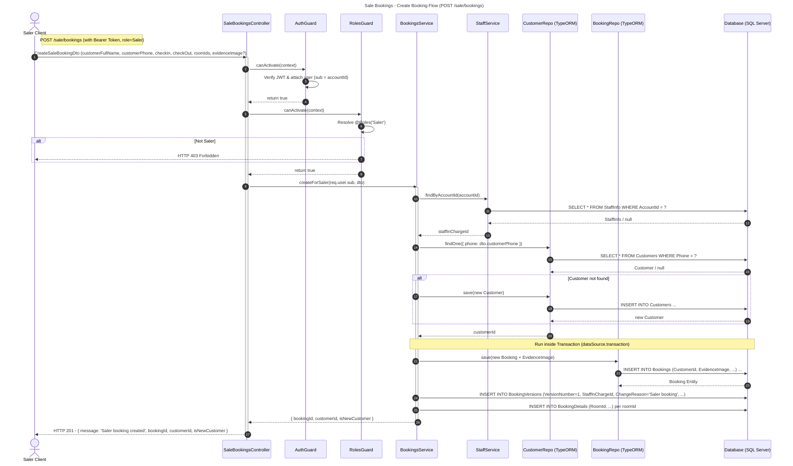
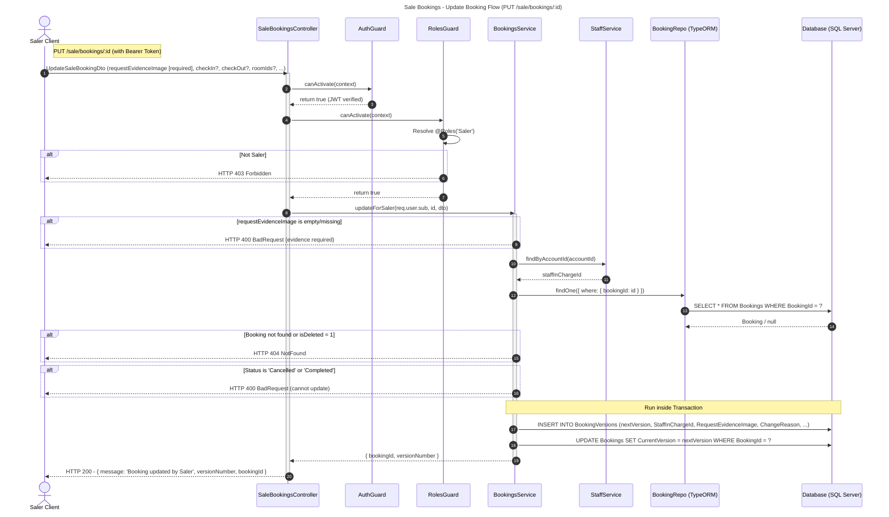
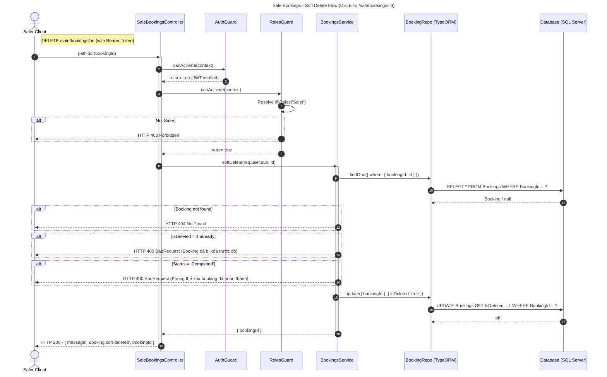
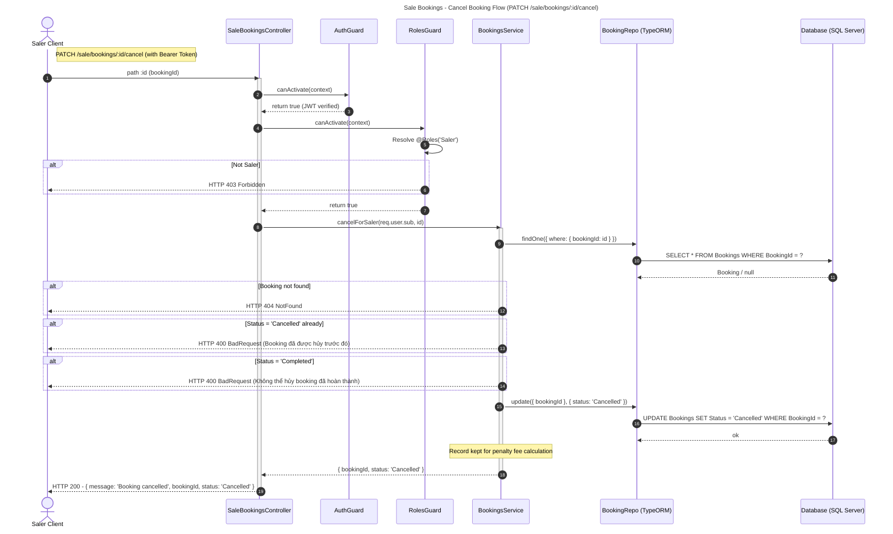

# Saler – Tổng hợp Class Diagram & Sequence Diagrams

> Tập hợp toàn bộ class diagram và sequence diagram cho các chức năng của **Saler** (role nhân viên bán hàng).  
> Saler có quyền truy cập `/staff` (xem/sửa profile cá nhân) và `/sale/bookings` (quản lý booking hộ khách).

---

## 1. Class Diagram

## 3. Sequence Diagrams – Sale Bookings (Chức năng chính của Saler)

### 3.1 POST /sale/bookings – Tạo booking hộ khách

---

### 3.2 PUT /sale/bookings/:id – Sửa booking (kèm evidence)

---

### 3.3 DELETE /sale/bookings/:id – Soft delete booking

---

### 3.4 PATCH /sale/bookings/:id/cancel – Hủy booking

---

## 4. Tóm tắt API Saler

| Method   | Endpoint                    | Mô tả                                  |
| -------- | --------------------------- | -------------------------------------- |
| `GET`    | `/staff/me`                 | Xem profile cá nhân                    |
| `PATCH`  | `/staff/me`                 | Cập nhật profile cá nhân               |
| `POST`   | `/sale/bookings`            | Tạo booking hộ khách (có ảnh bill)     |
| `PUT`    | `/sale/bookings/:id`        | Sửa booking (bắt buộc upload evidence) |
| `DELETE` | `/sale/bookings/:id`        | Soft delete booking tạo nhầm           |
| `PATCH`  | `/sale/bookings/:id/cancel` | Hủy booking (giữ record tính phí phạt) |
