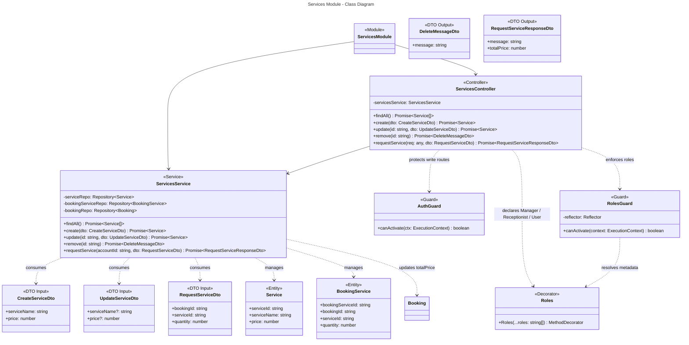
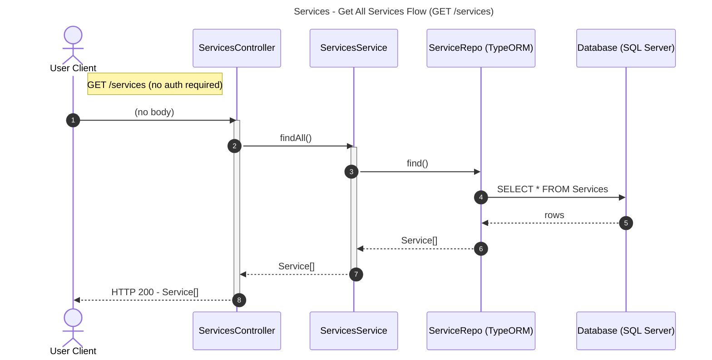
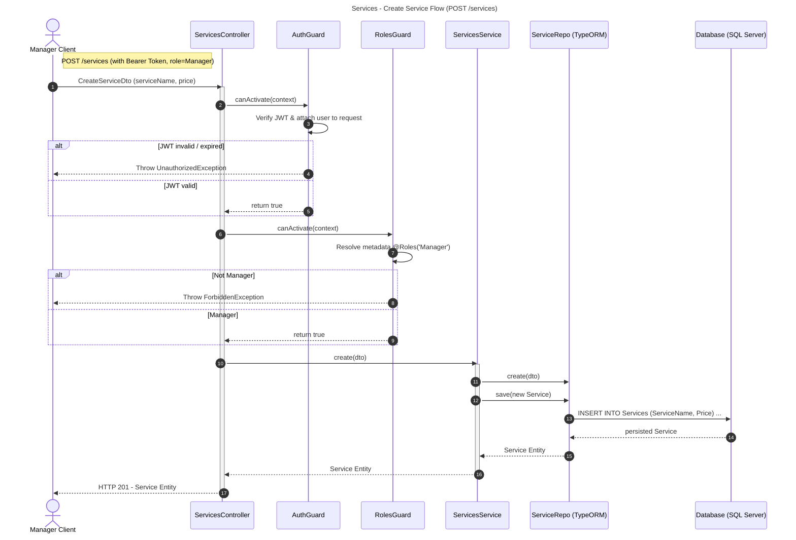
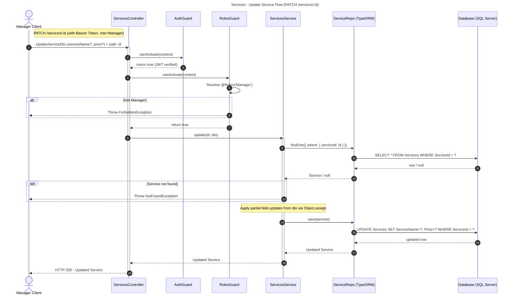
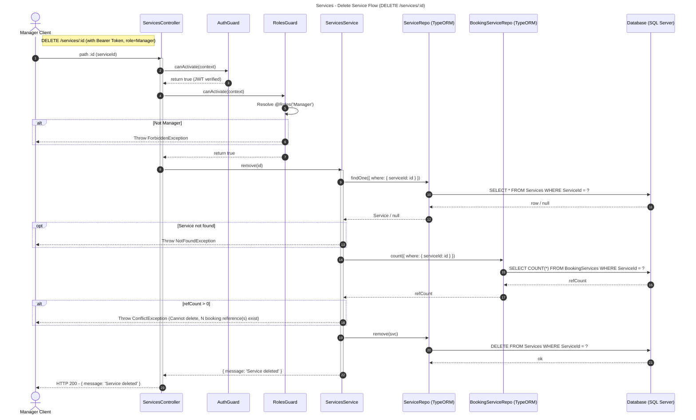
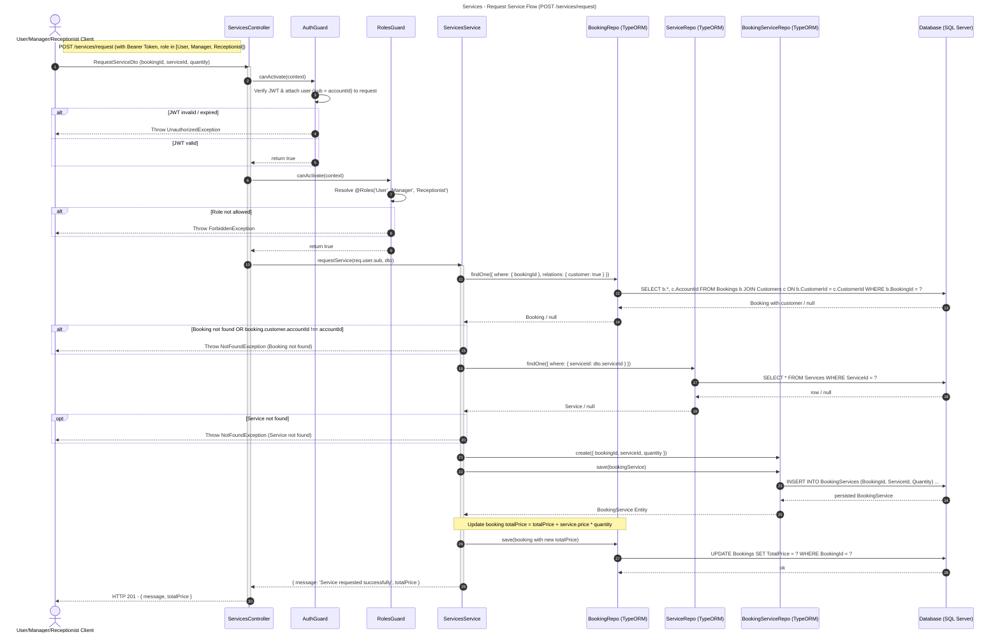

# Services Module – Tổng hợp Class Diagram & Sequence Diagrams

> Tổng hợp class diagram và sequence diagram cho **Services Module** (quản lý dịch vụ kèm theo booking: minibar, spa, ăn sáng...).

**Roles truy cập:**
- `GET /services` — Public, không cần auth.
- `POST /services`, `PATCH /services/:id`, `DELETE /services/:id` — **Manager**.
- `POST /services/request` — **User**, **Manager**, **Receptionist**.

---

## 1. Class Diagram

---

## 2. Sequence Diagrams

### 2.1 GET /services – Lấy danh sách dịch vụ *(public)*

---

### 2.2 POST /services – Tạo dịch vụ mới *(Manager)*

---

### 2.3 PATCH /services/:id – Cập nhật dịch vụ *(Manager)*

---

### 2.4 DELETE /services/:id – Xóa dịch vụ *(Manager)*

---

### 2.5 POST /services/request – Khách yêu cầu dịch vụ cho booking *(User/Manager/Receptionist)*

---

## 3. Tóm tắt API

| Method | Endpoint | Roles | Mô tả |
|--------|----------|-------|-------|
| `GET` | `/services` | Public | Lấy tất cả dịch vụ |
| `POST` | `/services` | Manager | Tạo dịch vụ mới |
| `PATCH` | `/services/:id` | Manager | Cập nhật dịch vụ (partial) |
| `DELETE` | `/services/:id` | Manager | Xóa dịch vụ (chặn nếu đang được booking tham chiếu) |
| `POST` | `/services/request` | User, Manager, Receptionist | Khách yêu cầu dịch vụ cho booking (ownership check) |

---

## 4. Notes quan trọng

- **Ownership check ở `requestService`**: `User` chỉ được request service cho booking thuộc customer của mình (`booking.customer.accountId === req.user.sub`). Manager/Receptionist bypass vì role đã cho phép.
- **Delete có ràng buộc**: `DELETE /services/:id` từ chối nếu `BookingServices` còn tham chiếu service này → tránh mất dữ liệu lịch sử.
- **Cập nhật `totalPrice`**: Mỗi lần `requestService` thành công, `Bookings.TotalPrice` được cộng dồn `service.price * quantity`. Không thực hiện transaction vì các bước tuần tự + FK đảm bảo.
